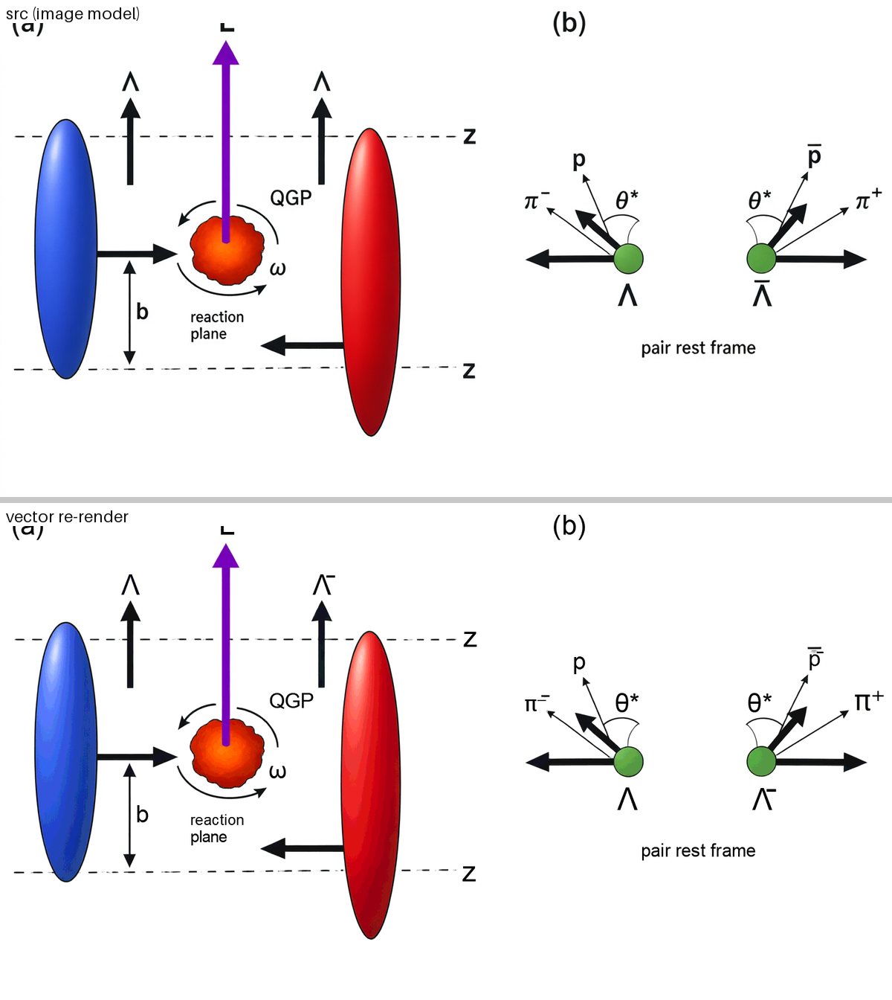
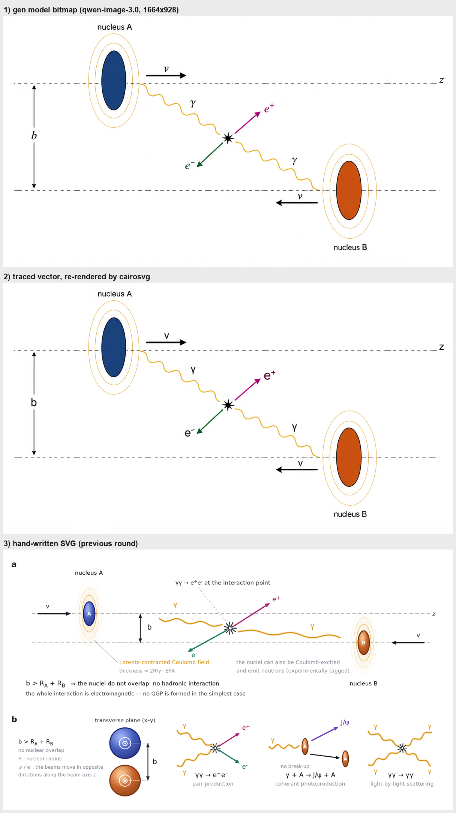
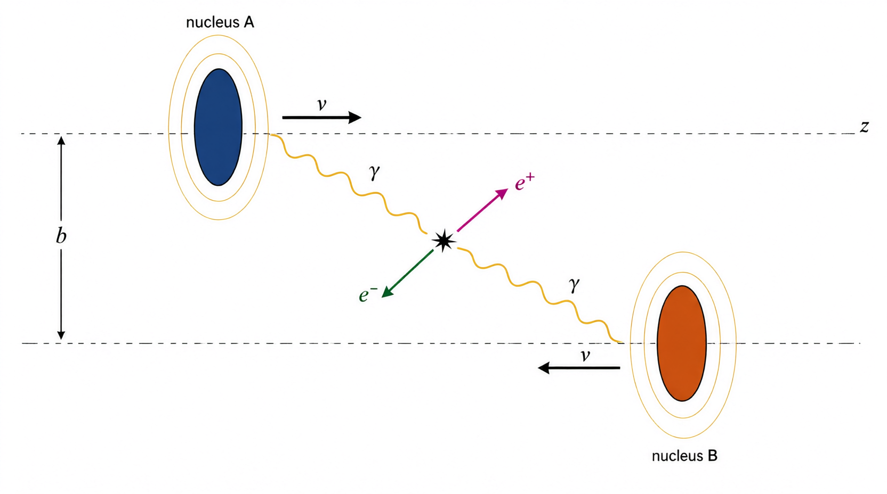
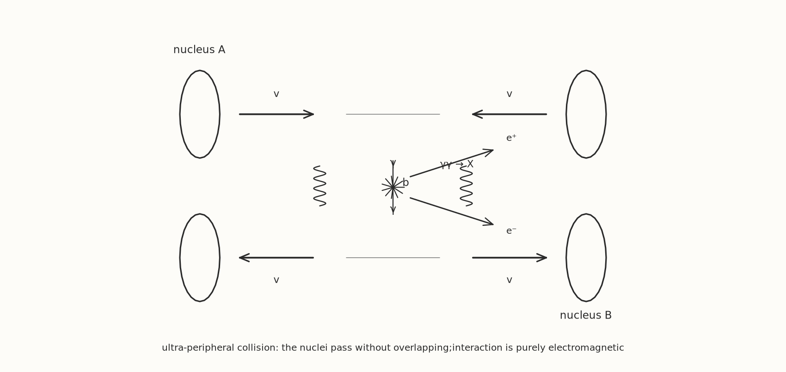

> # 📌 本分支 = 主线（v2.6）：三条路线合一
>
> 三条路线都在本分支里，**默认走路线 3**：IR → 生图简报 → 草图（+矢量草图）→
> 闸口① → 成品位图 → 闸口② → 重画/临摹成矢量 → 三道门禁 → 交付。
> 观感最好，代价是两次生图、可复现最差。
>
> `route-a` / `route-b1` / `route-b2` 是早期「一个分支一条路线」的旧版，
> 保留但不再更新；新装直接用 `main`。
>
> ```bash
> git clone https://github.com/YuhaoPeng1103/hep-nature-figure.git
> ```

---

# hep-nature-figure

**高能核物理期刊级配图 Skill** — 从参考图或手绘草图，产出**可编辑的矢量配图**。

[](LICENSE)

---

## 这个 skill 解决什么问题

做科研配图的痛点不是"不会画"，是**花太多时间画**；而且 AI 直接画往往
**"花里胡哨但物理表达不准确"**。

本 skill 的做法：**在动手之前，先把"这张图在物理上表达什么"写成结构化的 IR**，
画完再用**可判定的门禁**验收。

---

## 什么时候用它 / 适合做什么

- **画投稿级示意图** —— 碰撞 / QGP / 介质响应 / 喷注淬火 / 涡旋与整体极化 / 手绘草图转配图。
- **复现已有论文配图** —— 给一张参考图（或论文 PDF），先提取 IR 再生成，并附偏离量化。
- **要 3D 质感的示意图** —— 带光照、渐变、圆柱 / 火球 / 核子气这类"代码拼不出质感"的图。
- **多面板复合图** —— 面板标签、拼版保矢量（`assemble_panels.py`）。
- **投稿合规检查** —— 是不是纯矢量、文字能不能提取、最小字号、有没有嵌入位图、构图碰撞。
- **要一张"能改"的图** —— 图层按**物理元素**分组（`nucleus-A` / `photon-B` …），不是按颜色分层。

**不适合**：纯统计图（直方图 / 散点 / 热图）、交互式 dashboard、物理还没想清就要"一键出图"。

## 典型请求

- "参考 `_T3精选` 里的风格，画一张超边缘碰撞（UPC）的物理示意图。"
- "把这张手绘草图做成 Nature 级的 3D 配图，导 SVG + PDF。"
- "复现这张论文图（贴图），给我可编辑矢量，并说明哪里对不上。"
- "用最新的 skill 再跑一次自旋关联的示意图。"（→ 默认走路线③）
- "这张图除了文字都必须是矢量，渐变和阴影要保住。"
- "查一下这张图的 PDF 合不合投稿要求（矢量 / 字号 / 嵌入位图）。"

---

## ★ 分工：谁画、谁约束、谁验收

**画图交给模型，本 skill 负责约束、验收、返修。**

| 环节 | 谁做 | 为什么 |
|---|---|---|
| **画** | **模型** | 有视觉先验，能做出代码拼不出的质感 |
| **约束** | **IR + `geometry_constraints`** | 防"好看但物理错"——模型单干最爱犯 |
| **验收** | **三道门禁** | **模型看不见自己的输出**，这里能量 |
| **返修** | **`repair_brief.py` → 模型改** | 光说"文字重叠"模型只能猜；返修单给归一化坐标 + 具体改多少 |

> **不要试图用代码把图"画好看"** —— 那条路性价比极低。
> 代码该干的是**把模型的输出卡对**。

### 实测证据（外部 A/B）

同一张草图、同一个模型，只差"用不用本 skill"：

| | 不调用 skill | 调用 skill |
|---|---|---|
| 观感 | 一样漂亮 | **一样漂亮** |
| 几何约束 6 项 | **过 2 项** | **过 6 项** |

不调 skill 那版的具体违规：加了 IR 禁止的装饰元素、喷注端点出界、
胶子辐射画在了两条喷注上（应只有淬火那条）、两喷注夹角 173°（应 180°）、
**表面偏置丢了**（|v−C|/R = 0.85，应有 0.72 —— 而这是整张图的物理）。

---

## 完整流程

```
输入（参考图 / 草图 / 描述）
   ↓
① 写 IR —— 物理层 + 元素 + 构图 + geometry_constraints
      IR 就是"完善后给生图模型的 prompt"
   ↓
② IR → 约束简报              scripts/ir_to_genbrief.py --stage sketch
   ↓
③ 出草图（★ 必须带 --ref 风格参考图；key 用使用者自己的）
                             scripts/gen_figure.py --stage sketch
   ↓
④ ★ 草图矢量化 —— 人可改的 SVG 草图（必须输出）
                             scripts/sketch_to_vector.py
   ↓
⑤ ★ 闸口①：草图过物理检查（不能跳）      scripts/check_sketch.py
   ↓
⑥ 出成品位图（同样带 --ref）             scripts/gen_figure.py --stage render
   ↓
⑦ ★ 闸口②：成品位图再过一次同一个闸口    scripts/check_sketch.py
   ↓
⑧ 位图 → 矢量：首选重画（按结构/物理分层、保留色彩与阴影）
   备用混合临摹（逐像素描摹 + 文字擦掉重写真 <text>）
   ↓
⑨ 三道门禁 + 返修单 → 交付（SVG 工作稿 + PDF 交付稿）
```

**为什么要这两道闸口**：机器判不了物理。草图阶段先拦一次"元素缺失 / 喷注画反"，
成品位图阶段再拦一次"生图模型自作主张改了物理"。**闸口不是装饰，是流水线上的卡尺。**

**为什么第 ④ 环要输出矢量草图**：草图是给人改的。位图草图改不动，
矢量化之后人能在 Illustrator 里直接拖动某个形体，改完再回去生成品位图。

---

## 三条路线，怎么选

|  | **路线 1：直接代码出图** | **路线 2：生图草图 → 代码完善** | **路线 3：生图草图 → 成品位图 → 临摹** |
|---|---|---|---|
| 中间产物 | 无 | 草图 PNG + **矢量草图 SVG** | 草图 PNG + **矢量草图 SVG** + 成品位图 |
| 谁保证物理 | 代码（`geometry_constraints` 直接可算） | 闸口① | 闸口① + 闸口② |
| 观感 | 教科书插画 | 中 | **最好** |
| 可复现 | **最好**（逐字节） | 中 | **最差**（两次生图） |
| 成本 | 低 | 中 | 高 |

- **默认 = 路线 3。** "质感"这件事生图模型比代码强得多；只有要确定性时才退回 1。
- **只要确定性 / 要批量扫参数** → 路线 1（`scene_render.py` IR 直渲，或 `svg_lib` 手写）
- **要人插手改草图** → 路线 2（矢量草图交给人在 Illustrator 里改，再代码完善）

> 路线 2 和 3 的**前两段完全一样**（IR → 简报 → 生图 → 矢量草图 → 闸口①）。
> 区别只在第三段：2 是代码接着完善草图，3 是多跑一张成品位图再矢量化。
> 所以**默认的路线 3 也算复现任务** —— 位图临摹回矢量那一段就是复现。

> ⚠️ **可复现性尚未验证**：同 prompt 同 seed 两次输出是否一致，决定这条路能否做**交付**
> 而不只是**出稿**。这是当前最大的未解问题。

> ⚠️ **生图 key 由使用者自备**（环境变量 `DASHSCOPE_API_KEY`），skill 里不存任何 key；
> 没 key 也能 `gen_figure.py --dry-run` 走通全流程自检。


---

## 位图 → 矢量（第 ⑧ 步到底用哪个）

| | **模型看图重画（首选）** | `raster_to_vector_semantic.py`（备用） | `raster_to_vector.py`（备用） |
|---|---|---|---|
| 原理 | 看懂"这是核 / 这是光子线 / 这是顶点"再重画 | 自动切分定形状 + 人写元素表命名 | 等高线 → 填色路径，**没有"理解"** |
| 文字 | 真 `<text>` | **OCR + 逐词对齐**，真 `<text>` | 模型写 `--text-spec` 后擦掉重写 |
| 渐变 | **真 `<gradient>`**（保住色彩和阴影） | 色阶台阶，但**误差可量化可调**（`--R`） | 退化成色阶台阶 |
| 图层 | 按**结构/物理**（人手定） | 按**物理元素**（命名图层树，**不夹颜色层**） | 按**颜色**分，`--groups` 可归组 |
| 复现 | 两次不一样 | **逐字节相同** | 逐字节相同 |
| 依赖 | 无（模型干活） | `numpy scipy Pillow cairosvg cairocffi fontTools` | 还要 `cv2` / `skimage` |

选法：

- **默认 → 重画。** 看懂了再画，曲线干净、渐变是真渐变、图层是物理的。
- **要"和位图一模一样" → semantic 临摹。** 同分辨率 MAE 实测 0.2–0.5，
  代价是每条曲线碎成台阶，且每张图要手写 `words.txt` + `panels.py`。
- 图**本来就该拆成图元** → 别临摹，直接写 IR / 写 SVG，渐变是真渐变。

> **草图那条走 `sketch_to_vector.py`**：它默认 `--q 16`（每通道颜色量化级数）。
> AI 出的草图边缘全是抗锯齿过渡带，不量化会切出 **30412** 条碎路径（没法给人改）；
> 量化到 16 级只剩 **2111** 条，而 >8 色阶的像素占比从 0.32% 到 **0.31%**（几乎不变）。
> 要求严格保真就 `--q 0`。

**两条路都要求**：文字是真 `<text>`、图层按**物理元素**分（颜色只是 `<path>` 的属性）。

> ⚠️ **不论走哪条，纯像素描摹一定不行**：文字会全变成轮廓。
> 实测同一张图，纯描摹 `<text>` 元素 **0 个**；给文字清单后 **3 个**。

```bash
# ① 出词表（Windows.Media.Ocr，自动 2× 放大）
powershell -File scripts/raster_vector/ocr_words.ps1 -Image fig.png -Out words.txt
# ② 照着 scripts/raster_vector/panels.py 改出这张图的 CELLS / ELEMENTS / SPLIT
# ③ 组装 + 自检
python3 scripts/raster_to_vector_semantic.py fig.png -o fig.svg \
        --words words.txt --panels my_panels.py --legend fig_layers.md --elmap fig_el.png --check
```

> ★ **semantic 这条要人写两张每图各不相同的表**：`words.txt`（OCR 词表）和 `panels.py`
> （面板框 + 物理元素框 + 颜色条件）。自动切分只负责"形状对不对"，
> **"这块叫什么物理名字"必须人来写** —— 这是它比纯描摹贵的地方，也是它准的地方。

实测（T3-01 Jia2026 Fig.1，1200×1133，4.7 MB）：

| 指标 | 值 |
|---|---|
| 非文字区（纯矢量色块）MAE / >32 色阶像素 | **0.227** / **0.00%** |
| 整图 MAE / PSNR | 1.48 / 26.5 dB |
| `<path>` / `<text>` / `<image>` | 37930 / 54 / **0** |
| 图层 | 12 面板 / **50 物理元素** |

> ⚠️ **两条备用路都做不出真渐变网格**。原图的连续渐变在矢量里只能是色阶台阶
> （调小 `--R` 变细，代价是路径数/体积）或真 `<gradient>`（要求图能拆成图元）。
> 只适合「色块 + 硬边」类图（示意 / 三维渲染示意图）；照片、有机纹理要靠**重画**。

---

## 示例预览

| 方向 | 预览 | 看点 |
|---|---|---|
| 自旋关联示意图（路线③ 全过程） | <a href="assets/demos/spin_semantic/cmp_preview.png"></a> | 上 = 生图模型的成品位图，下 = 临摹矢量回渲染；非文字区 MAE **0.518**、`<image>` **0** |
| UPC 示意图（三条落点并排） | <a href="assets/demos/upc_semantic/cmp_preview.png"></a> | 1 生图位图 / 2 语义临摹 / 3 代码直写 —— 同一条主线的三种落点 |
| 生图模型的成品位图（原图） | <a href="assets/demos/upc_semantic/src_upc.png"></a> | 路线③ 的中间产物：只当作"更好的草图"，它过了闸口才允许照它画 |
| 手绘草图（路线②③ 的输入） | <a href="assets/demos/sketch_upc.png"></a> | 草图只要求"构图清晰、元素齐全"，质感由后面的生图负责 |

## 你需要提供

- **物理内容** —— 这张图要表达什么（几句话也行）。它是 IR 里 `physics` 的来源，也是闸口的判据。
- **参考图 / 草图**（可选但强烈建议）—— 风格参考走 `--ref`；复现任务要另给原图。
- **目标规格** —— 单栏 / 双栏、目标期刊、要 SVG / PDF / PNG 里的哪些。
- **生图模型的 API key**（走路线②③时）—— 本 skill **不携带、不保存**任何 key，用你自己的
  （`gen_figure.py` 读环境变量 `DASHSCOPE_API_KEY`；没 key 可以 `--dry-run` 只出自检计划）。

## 产出

- **可编辑矢量**：`<path>` 按物理元素分层 + 真 `<text>`（文字可提取、可改）+ `<image>` **0** 个。
- **投稿 PDF**（默认 183×102 mm 双栏）+ 可选 PNG 预览。
- **中间产物全部落盘**：IR、生图简报、草图 PNG、**矢量化草图 SVG**、成品位图，以及
  每个 seed 的 `calls.jsonl`（model / seed / size / refs / prompt 指纹 / 耗时）。
- **验收记录**：闸口①/② 的逐条结论、临摹自检（MAE / PSNR / 色阶差）、交付门禁、构图审计。
- **图层清单**（`*_layers.md`）：每个物理元素一行 —— 在 Illustrator / Inkscape 的图层面板里
  按名字点选就能改，不用在图里找。

---

## 安装

### Claude Code

```bash
git clone https://github.com/YuhaoPeng1103/hep-nature-figure.git \
  ~/.claude/skills/hep-nature-figure
```

或建软链：

```bash
ln -s /path/to/hep-nature-figure ~/.claude/skills/hep-nature-figure
```

装好后用 `/hep-nature-figure` 或在对话里描述任务即可触发。

### 其他平台

`SKILL.md` + `references/` 的内容是**平台无关的方法论**，可移植到
ChatGPT（Instructions + Knowledge 文件）、Cursor、Codex 等。

---

## 环境要求

**核心（必需）**：

```bash
pip install -r requirements.txt
# 或手动：
pip install numpy pillow cairosvg pymupdf matplotlib scipy shapely \
            pyyaml opencv-python
```

**按需**（不同图型需要不同工具）：

| 工具 | 用于 | 安装 |
|---|---|---|
| Inkscape | 人工精修矢量 | `sudo apt install inkscape` |
| LaTeX (pdflatex) | 公式、TikZ | `sudo apt install texlive-latex-recommended texlive-pictures` |
| Blender | 真 3D 几何 | https://www.blender.org/download/ |
| ROOT | `.root` 文件、领域惯例图 | https://root.cern/install/ |
| Asymptote | 程序化矢量图 | `sudo apt install asymptote` |
| Ipe | 公式密集的整图 | `sudo apt install ipe` |

**先用脚本探测本机有什么、缺什么该装什么**：

```bash
python3 scripts/check_tools.py
```

输出示例：

```
✅ 已可用（5）   Python+matplotlib · cairosvg · PyMuPDF · LaTeX · ROOT
❌ 缺失（6）     Inkscape · Ipe · Asymptote · Blender · Mathematica · Illustrator
                 ↑ 每项都给出对应平台的安装命令
```

> **缺工具 = 去装，不是绕开。** 这是这个 skill 的一条硬纪律。

---

## 快速开始

```bash
# 1. 看本机有什么工具
python3 scripts/check_tools.py

# 2. 从论文 PDF 切参考图
python3 scripts/extract_figures.py paper.pdf -o refs/

# 3. 写 IR（参考 references/ir-spec.md 的格式）
#    —— 这一步不可跳过，是物理正确性的保证

# 4. 按 IR 实现，渲染
#    图元库在 scripts/svg_lib.py

# 5. 迭代：与参考图并排对比
python3 scripts/compare_ref.py 参考图.png 我的图.png -o cmp.png

# 6. 交付前检查
python3 scripts/check_delivery.py fig.pdf fig.eps
```

### 多工具联合示例

```bash
python3 scripts/demo_combined.py
# 卡通示意(svg_lib) + 物理公式(TikZ) + 合成(PyMuPDF) → PDF + EPS
```

---

## 目录结构

```
.
├── SKILL.md                     路由器：判任务 → 写 IR → 选后端 → 执行 → 验证
├── CHANGELOG.md                 每个版本修了什么（每条都带实测对照）
├── requirements.txt             依赖（numpy / scipy / Pillow / shapely / cairosvg / PyMuPDF …）
├── references/                  写作与排查时翻的规范（见下面「内置参考」）
├── scripts/
│   ├── svg_lib.py               SVG 图元库（火球 / 圆柱 / 核子 / 壳 / 环 / 坐标轴 / 图层）
│   ├── geom.py                  shapely 布尔运算 → SVG path（外轮廓、有机团块）
│   ├── cartoon_lib.py           卡通示意（手绘感）图元
│   ├── scene_render.py          路线 1：IR 直渲（确定性，可批量扫参数）
│   ├── verify_scene.py          路线 1 的几何自检（量 IR 里写了数量的元素）
│   ├── ir_to_genbrief.py        IR → 生图简报（--stage sketch / render）
│   ├── gen_figure.py            ★ 第③步：生图（简报 → 草图 / 成品位图）。key 自备，支持 --ref
│   ├── trim_border.py           ★ 裁掉生图模型稳定画的 1~2px 外框（幂等）
│   ├── sketch_to_vector.py      ★ 第④步：草图矢量化成可改的 SVG（不用写 panels.py）
│   ├── check_sketch.py          ★ 闸口①/②：草图与成品位图的物理检查
│   ├── raster_to_vector.py      位图 → 矢量（临摹备用）：逐像素 + 混合文字 + --groups
│   ├── raster_to_vector_semantic.py  位图 → 语义分层的全矢量 SVG（先理解再临摹）
│   ├── raster_vector/           上面那条的库（quadtree / labels / elements / panels / groupvec / raster_ops）
│   ├── check_tools.py           工具能力探测 + 装机指引
│   ├── check_render.py          渲染静默失败检测（渐变失效 / 字体丢失都不报错）
│   ├── check_delivery.py        投稿检查（矢量？文字可编辑？字号达标？）
│   ├── delivery_gate.py         风格档案门禁（偏离超限 → 阻断）
│   ├── audit_composition.py     构图审计（文字重叠 / 线穿文字 / 出界 / 留白）
│   ├── audit_panels.py          多面板对齐审计
│   ├── assemble_panels.py       复合图拼版（保矢量）
│   ├── compare_ref.py           参考图与成图并排对比
│   ├── style_bench.py / style_profile.py   风格量化与建档
│   ├── auto_converge.py         自动收敛循环（量 → 定位 → 修正 → 复测）
│   ├── extract_figures.py       从论文 PDF 自动切图
│   ├── repair_brief.py          返修单（归一化坐标 + 具体改多少）
│   └── demo_*.py                多工具联合 / 喷注淬火 / 时间线 示范
├── evals/
│   ├── test_tools.py            17 个回归 case（每个对应一个真实踩过的坑）
│   └── evals.json / README.md   评测清单
└── assets/
    ├── style-profiles.json      风格档案（门禁用；存**区间**不存点值）
    ├── t3-exemplars/            参考图库（2 张 CC-BY 图 + `NOTICE.md` 版权说明）
    ├── ir/                      7 套 IR 标准答案（含 UPC / 自旋关联两个完整算例）
    └── demos/
        ├── upc_semantic/        UPC 完整算例（词表 / 元素表 / 源图 / 并排预览）
        └── spin_semantic/       自旋关联完整算例（同上，v2.6.3）
```

---

## 内置参考（索引）

| 文件 | 什么时候看 |
|---|---|
| `references/ir-spec.md` | 写 IR 之前 —— 六层规范（物理 / 元素 / 构图 / 风格 / 执行 / 验收） |
| `references/tool-selection.md` | 不确定该用哪个后端时（内容轴 × 风格轴） |
| `references/svg-cookbook.md` | 手写 SVG 时 —— 技法 + 7 个渲染陷阱 |
| `references/multi-tool.md` | 一张图要多个工具合做，或要定交付格式时 |
| `references/style-bench.md` | 要用风格指标做诊断时 —— 含 4 个测量陷阱 |
| `references/gotchas.md` | 渲染"看着成功其实失败"时（静默失败详解） |
| `evals/test_tools.py` | 改完任何工具之后 —— 跑一遍防"修一个坏一个" |
| `CHANGELOG.md` | 想知道某个坑是什么时候、怎么修的（每条都带实测数字） |
| `assets/demos/upc_semantic/`、`assets/demos/spin_semantic/` | 想照抄一个完整算例（词表 + 元素表 + 命令 + 实测数字） |

---

## 五条硬纪律

写在 `SKILL.md` 里，是踩坑换来的：

0. **不要把版权受限的图打包发布**
   建参考图库前先看许可：CC-BY 可再分发（需署名），
   CC-BY-NC / 版权保留只能内部用。
   *踩坑*：本仓库最初打包了 8 张参考图，推之前查证才发现
   5 张来自 Springer Nature 综述和 Nature 非 OA 文章，已改为只留 CC-BY。

1. **几何量必须【量】，禁止【看】**
   数量、角度、比例、坐标必须写脚本扫像素得出。
   *踩坑*：目测 T3-03 的径向线得出"48 条"，脚本一扫是 **40 条**。

2. **绘制顺序就是 z 序**
   后画的盖住先画的，画反了元素会**凭空消失且不报错**。

3. **风格指标是【诊断工具】，不是【优化目标】**
   指标告诉你往哪看，不告诉你调到多少。
   *踩坑*：按指标"整体降饱和+加深描边"，把不该压暗的平面也压暗，
   3 项指标反而恶化、视觉更差。
   正确流程：**量 → 判断 → 把指标对应的像素可视化、找到具体原因 → 只改那一处 → 复测 → 看图**。

4. **物理正确性无法自动验证**
   复现任务有参考图当 ground truth；创作任务**必须人看**。
   **不要说"自动达到 Nature 级"**——能说的是"把偏离量化、让失败可见"。

---

## 关于参考图的版权

`assets/t3-exemplars/` **只包含 CC-BY 开放获取的图**（STAR, Nature 2024），
其余参考图因版权原因**未随仓库分发** —— 详见
[`assets/t3-exemplars/NOTICE.md`](assets/t3-exemplars/NOTICE.md)，
里面有每张图的出处和获取方式。

自己建库：

```bash
python3 scripts/extract_figures.py 你的论文.pdf -o refs/
```

> **不要把版权受限的论文配图打包发布。** 这是使用本 skill 时容易踩的坑。

## 诚实的边界

这个 skill **不是**"一键出 Nature 级图"。

| 能做 | 不能做 |
|---|---|
| 从图/草图提取结构化 IR | 精确复现每个元素的位置 |
| 按图型选后端并调用 | 复现有机/程序化生成的形状 |
| 输出分层干净、可精修的矢量 | 达到"并排看不出差别" |
| 量化偏离、自动收敛到参数最优 | 突破参数空间能表达的上限 |
| 保证投稿合规（矢量、字号、可编辑） | 替代人的审美判断 |

**它提高下限、让失败可见，不替代人。** 最终质量判定仍需人看图。

> 其中「精确复现位置」这一条，`raster_to_vector_semantic.py` 对**平色块图**已经做到
> （非文字区 MAE 0.227、>32 色阶像素 0.00%）。它做不到的是**连续渐变的平滑**
> —— 矢量里只能是色阶台阶，或真 `<gradient>`（后者要求图能拆成图元）。

按 Nature 官方美术指南，本来就没有"一步到位的成品"：各面板在各自软件做，
最后在矢量编辑器里合成，美术团队还可能重画。所以"能直接用"的准确含义是
**「输出的稿子在 Inkscape/Illustrator 里打开，不用重画、只需调整」**。

---

## 与其他 skill / 工具的关系

- **`imagegen`（通用位图生成）** —— 只要一张好看的位图、不涉及物理正确性判定时用它；
  要"物理对 + 可编辑矢量 + 投稿合规"时用本 skill（路线②③自己调生图模型）。
- **`pdf`** —— 需要表单 / 提取 / 更复杂的 PDF 操作时交给它；本 skill 的投稿 PDF 走 Edge
  `--print-to-pdf`（cairosvg 出大 SVG 会 OOM）。
- **`visualize`** —— 交互式、探索式的图表和模拟用它；本 skill 只做**静态投稿图件**。
- **`presentations` / `documents`** —— 图件定稿后要放进 slides / 文稿时，把 SVG/PDF 交给它们。
- 本 skill **不做**统计检验、也不替论文叙事 —— 那部分交给对应工具。

---

## 参考

- [Nature 美术指南](https://www.nature.com/nprot/for-authors/protocols) —
  线稿/示意图首选 AI / EPS / PDF，必须可编辑矢量
- [Nature 配图模板](https://research-figure-guide.nature.com/resources/templates/)

---

## License

MIT
