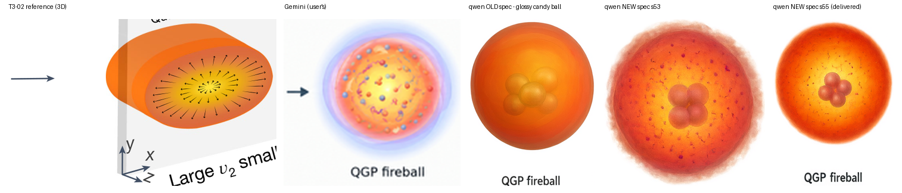

# 算例：火球为什么「很难看」—— `material` 从没进过简报

**回答**：「我感觉这个 fireball 还不错，但是质感不对，很像 AI 画风，
为啥你的 diffusion model 生成的 fireball 这么不好看？」

**不是模型的锅，也不是 diffusion 不行** —— 是 **IR 的 `material:` 根本没送到模型手里**，
模型只收到一句硬编码的「火球 = 内亮外暗的多层半透明渐变，边缘柔和」。

## 两个 bug（都在 `ir_to_genbrief.py`）

| # | bug | 后果 |
|---|---|---|
| 1 | IR 的 `material:` **从不进简报**（0 次出现；元素表只带 `primitive`） | 你在 IR 里写的「哑光 / 三层壳 / 组元颗粒」模型一个字都看不到 |
| 2 | 简报**硬编码**了火球长什么样：`"火球/热区：内亮外暗的多层半透明渐变（亮核→橙→红）…边缘柔和但不模糊"` | 不管 IR 写什么，模型都被按在一颗**光滑高光球**上 |

再叠加 §五.1「不要添加 IR 元素清单里没有的东西」→ 模型连内部结构都**不许**加。
于是它只能画一颗光滑的橙色糖球。这就是"AI 画风"的来源：
**光滑高光 + 均匀径向渐变 + 无内部结构 = 通用 CG 球**。

## 5 方对照：火球本身



| 图 | 内部高频能量 ↑ | 盘内最亮 1% 亮度 | 内部小暗团数 ↑ |
|---|---|---|---|
| Gemini（用户觉得还行） | 0.0586 | 0.952 | 55 |
| **qwen 旧 spec**（硬编码） | **0.0103** | 0.729 | 128 |
| qwen 新 spec，seed 53 | 0.0265 | 0.755 | 704 |
| qwen 新 spec，seed 51 | 0.0418 | 0.841 | 208 |

- 「内部高频能量」= 盘内灰度减掉大尺度模糊后的标准差 —— 度量**内部有没有结构**。
  旧 spec 是全部里**最平滑**的（0.0103），因为那就是一个纯渐变球；新 spec 是它的 **2.6~4 倍**。
- 只有 spec 变了：**同一个模型（qwen-image-3.0）、同一份构图、同一个 seed 53**。

## 修法

1. **`material` 进简报**：元素表每条现在带 `【材质：…】`（`shape_hint` 旁边新增）。
2. **删掉硬编码的火球描述**，换成「发光体 / 热区怎么画，以第一节各元素的【材质】为准」。
3. **禁止项留口子**：§五.1 由「不要加 IR 清单里没有的东西」改成
   「不要加**【独立物体/箭头/文字/装饰光晕】**；但【材质】里写明的内部结构
   （分层 / 组元颗粒 / 场线 / 亮核 / 外壳 / 日冕）**必须画出来** —— 那是规格，不是装饰」。
4. 「颗粒/噪点」澄清为**胶片颗粒/噪点纹理** —— 示意性的细小符号（组元点、场线）不算，
   否则会把 material 要求的结构一起禁掉。

## 本图的火球 spec（写进 IR 的 `material:`）

哑光的等离子体团（不要高光反射 / 塑料光泽 / 辉光外溢 bloom）；
由内到外**分三层、边界要看得出来是三层**：① 亮黄白热核 ② 橙→红等离子体壳
③ 半透明橙红日冕（边缘羽化）；内部散布**组元颗粒**与**弯曲短丝线**（夸克 / 胶子场），
随机分布不排成规则网格；最里面是 4 个相互重叠的参与者核子球。

> ★ 这条是**内容决定**（把夸克/胶子画成细小符号），可以按需增删；
> 但「不要让 `material` 缺席、不要硬编码」是工具层的修复。

## 交付物

| 文件 | `<path>` | `<text>` | `<image>` | 体积 | MAE | PSNR |
|---|---|---|---|---|---|---|
| `evo4_edit.svg` | 34291 | 5 | **0** | 6.38 MB | 0.641 | 30.98 dB |

- 位图 `src_render.png` = gen7 seed 55（四个标签拼写全对）。
- 图层按**物理元素**分组：`stage1-nucleus` / `stage1-nucleons` / `stage2-fluctuations` /
  `stage3-nucleus-A` / `stage3-nucleus-B` / `stage3-overlap` / `stage4-fireball` /
  `stage4-nucleons` / `arrow-1..3` / `text`（见 `evo4_edit_layers.md`）。
- 闸口②（7 条物理问题）+ 交付门禁（34292 条顶层指令 / 嵌入位图 0 / 最小字号 9.3 pt）
  + 构图审计（文字重叠 0 / 穿字 0 / 出界 0）全部通过。

## 复现

```bash
# 1) 改 IR 的 material（本算例的写法见上面的「火球 spec」）
python3 scripts/ir_to_genbrief.py sketch7_deformed_to_fireball.ir.yaml \
    --stage render --style-mode auto -o brief_render.md

# 2) 出图（构图参考默认自动降级成 layout-only，见 evo3d_layoutref 算例）
python3 scripts/gen_figure.py --brief brief_render.md --stage render \
    --content-ref <上一步选中的草图> --ref <T3-02 那类风格参考> \
    --seeds 51,53,55,57 --outdir gen7/

# 3) 闸口② -> 位图转矢量
python3 scripts/check_sketch.py gen7/render_s55_clean.png --ir sketch7_deformed_to_fireball.ir.yaml
python3 scripts/raster_to_vector_semantic.py gen7/render_s55_clean.png \
    -o gen7/evo4_edit.svg --words words_s55.txt --panels panels_evo3.py \
    --W 1664 --R 5 --q 0 --legend gen7/evo4_edit_layers.md --check
```

（`--panels panels_evo3.py` 在兄弟算例 `evo3d_layoutref/` 里。）
