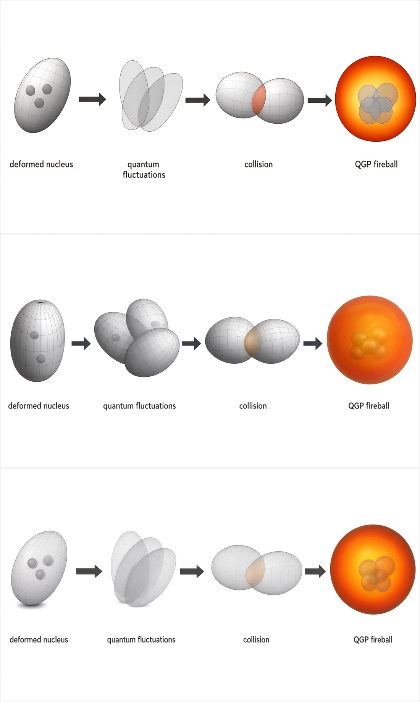

# 算例：构图参考（`--content-ref`）会把「扁平」当风格一起送进去

**回答**：「主要这个真的很难看啊，难道 diffusion model 最好只能画成这样？」

**不是模型的锅** —— 是本 skill 的 `--content-ref` 在压着它。

## 现象

形变核 → 火球四阶段链，同一份简报、同一个模型（`qwen-image-3.0`）、同一个 seed，
出的火球是个**纯色橙盘**，完全没有 `_T3精选/T3-02` 那种 3D 质感。

## A/B/C（同一份简报，seed 53）



| | content-ref 怎么送的 | 与草图布局的列剖面相关 r | 火球 |
|---|---|---|---|
| A | 原样送（旧行为） | 0.873 | **纯色橙盘** |
| B | 不送 | 0.696 | 3D 辉光，但构图跑掉（三取向涨落画成三个球） |
| C | **降级成 layout-only** | **0.904** | **3D 辉光 + 亮核** |

- `layout_ref.png` = C 实际送进模型的构图参考（灰度 + 降采样再放大 + 轻微模糊）。
- `src_render.png` = C 出的成品位图（就是 B 之上补回构图的那张）。

## 根因

qwen-image 是**图生图**。`--content-ref` 传的草图是**扁平**的，模型会把
「扁平」这个**渲染风格**连同构图**一起**继承，把 `--ref` 风格参考稀释掉 ——
于是"用了 diffusion model 却没用它的好处"。

> ★ 注意 C 不是"拿构图换风格"：**两边同时变好**（0.873 → 0.904）。

## 修法

`gen_figure.py --content-ref-mode auto|layout|full`（默认 `auto`）：

| 档 | 行为 |
|---|---|
| `auto` | `--stage render` 降级成 layout-only；`--stage sketch` 原样（草图阶段本来就该跟手绘稿走） |
| `layout` | 总是降级 |
| `full` | 总是原样（想让模型连草图风格一起继承时用） |

只降级 `--content-ref`；`--ref` 风格参考**原样送**。降级图落在 `--outdir/layout_*.png`，
送模型的是哪张记在 `calls.jsonl` 的 `content_ref_sent`。

## 本算例的交付物

| 文件 | `<path>` | `<text>` | `<image>` | 体积 | MAE(非文字区) | PSNR |
|---|---|---|---|---|---|---|
| `evo3_edit.svg` | 21151 | 5 | **0** | 5.44 MB | 0.810 | 29.12 dB |

- 图层按**物理元素**分组（`stage1-nucleus` / `stage2-fluctuations` / `stage3-nucleus-A` /
  `stage3-overlap` / `stage4-fireball` / `stage4-nucleons` / `arrow-1..3` / `text`），
  **不是**按颜色分层 —— 见 `evo3_edit_layers.md`。元素判据在 `panels_evo3.py` 的 `ELEMENTS`。
- 文字是可编辑真 `<text>`（`words_s53.txt` 是 OCR 词表），`<image>` = 0（纯矢量）。
- `evo3_edit.pdf` = `evo3_edit.svg` 落在 183×102 mm 双栏（Edge headless 打印）。
- 交付门禁：`check_delivery.py` 通过（42548 条顶层指令 / 嵌入位图 0 / 可提取文字 60 字符 /
  最小字号 9.5 pt）；`audit_composition.py` 0 问题（文字重叠 0 / 穿字 0 / 出界 0）。

## 复现

```bash
# 1) 出成品位图。★ --content-ref 走的是"降级后的构图参考"，这一步由 gen_figure.py 自动做
#    （render 档默认 --content-ref-mode auto -> layout），不用手动处理。
python3 scripts/gen_figure.py --brief brief_render.md --stage render \
    --content-ref <上一步选中的草图> --ref <T3-02 那种风格参考> \
    --seeds 53 --outdir gen5/

# 2) 裁外框（模型稳定在四周画 1~2px 框）
python3 scripts/trim_border.py gen5/render_s53.png -o gen5/render_s53_clean.png

# 3) 位图 -> 分层矢量（本算例交付用的就是这条命令，已实测**逐 path 复现**：
#    21151 <path> / 5 <text> / 0 <image> / 5.44 MB）
python3 scripts/raster_to_vector_semantic.py gen5/render_s53_clean.png \
    -o gen5/evo3_edit.svg --words words_s53.txt --panels panels_evo3.py \
    --W 1664 --R 5 --q 0 \
    --legend gen5/evo3_edit_layers.md --el_txt gen5/_elem.txt --check
```

- **不需要 `--shade`**：本图的「基色 + 明度层」重写规则写在 `panels_evo3.py` 的
  `SHADING` 表里（`--shade` 是给"没有 panels 表、想全局套一档"的场景用的）。
  注意 `SHADING` **没有 `"*"` 默认档**：只给核 / 涨落 / 两核 / 重叠区 / 三个箭头开重写；
  **火球与中心核子簇保留逐色临摹** —— 实测 3D 辉光 + 半透明叠球用
  「基色 + 32 档明度」拟合不过关（火球被压成发暗红盘 + 黄斑，MAE 1.240）。
- `--el_txt` 的明细表要落在 `-o` 的 SVG 旁边（本算例写成了 `gen5/_elem.txt`）。

`calls.jsonl` 是本次所有生图调用的记录（model / seed / size / refs / 耗时 / 成败）。
