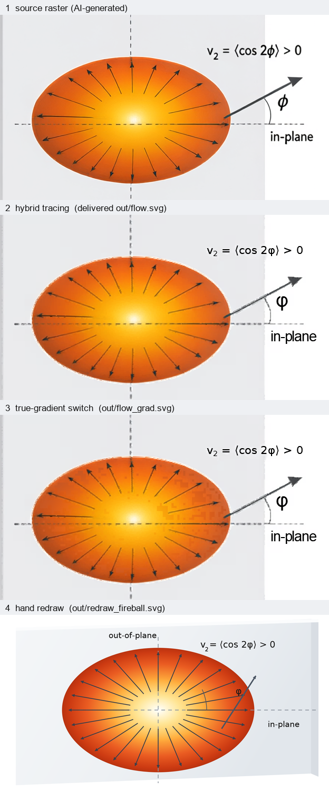

# 集体流示意图（IR: COLLECTIVE-FLOW-1）—— 位图 → 矢量，到底有几种做法

这份 README 只讲一件事：**从位图到矢量，skill 里到底有几种做法、各自长什么样、本图为什么这么选。**
交付物与全部机器检查数字见 [`DELIVERY.md`](DELIVERY.md)。



## 先纠正一个容易混的说法

不是"重画 / 混合临摹 / 真渐变"三种并列。skill 第 ④ 步只有**两个终点**，
"真渐变"是挂在终点内部的一个**逐元素开关**：

```
整条流程：路线 1 / 2 / 3            ← 决定"图从哪来"（代码直出 / 草图→代码 / 草图→位图）
            ↓
第 ④ 步  位图 → 矢量：只有两个终点
            ├─ 重画（首选、默认）      看懂每个部分是什么，手写 SVG / Illustrator
            └─ 混合临摹（备用）        逐像素描摹 + 文字擦掉重写真 <text>
                     └─ 逐元素开关（不改变终点，只改"颜色怎么画"）：
                        · GRADIENTS  某元素的颜色拟合成真 <radialGradient>
                        · SHADING    某元素重写成「基色 + N 档明度层」
                        · --q 量化   色阶细密程度
                        · 文字重写 / SPLIT 细分 / EXTRA_ERASE 补擦
```

## 四个实例：都用同一个物理元素（末态火球 v₂ > 0）

### 例 1 重画（skill 的首选 / 默认）

- 文件：[`redraw_fireball.svg`](redraw_fireball.svg)、[`redraw_fireball.png`](redraw_fireball.png)；源码 [`redraw_demo.py`](redraw_demo.py)（~100 行）
- 体积：SVG **12 KB**（同样这一格在临摹版里是几千条 1px 小格、占着 MB 级体积）
- 做法：火球 = 一个椭圆 + 真 `<radialGradient>`（用 objectBoundingBox 单位，渐变自动被拉成椭圆，
  不需要 gradientTransform）；径向箭头**尖端落在椭圆表面**，所以面内/面外长度比自动等于椭圆长宽比；
  薄板 = 一个四边形 + 两条厚度边；六个图层（薄板 / 火球 / 方向虚线 / 径向箭头 / φ 参考箭头 / 文字）
- **关键差别：物理量是参数。** `V2` 一行同时决定火球多扁、箭头多各向异性：

  ```python
  RX, RY = R0*(1+V2), R0*(1-V2)      # V2 = 0.216  →  RX/RY = 1.55
  ```

  实测输出：面内箭头 114.9 px / 面外 74.1 px = **1.55**（这个 1.55 是算出来的，不是从位图描出来的）。
  把 `V2` 改大 → 火球更扁、箭头更各向异性；改 `R0` → 整体大小变。**临摹版做不到这件事。**
- 代价（对比图第 4 格）：这是**重新演绎**，不是复制 AI 位图的观感 —— 球面经纬网格、边缘压暗、
  高光形状都要自己造；本格火球只用了 6 档 stop，颜色是按物理定的，和原图的橙→黄色阶不完全一样。

### 例 2 混合临摹（备用；**本图实际交付的就是这个**）

- 文件：[`flow_edit.svg`](flow_edit.svg)、[`flow_edit.pdf`](flow_edit.pdf)、[`flow_render.png`](flow_render.png)
- 做法：自适应四叉树逐像素描摹（每条 path 一个纯色）+ 文字擦掉重写真 `<text>` + 按物理元素分组命名
- 数字：**38,079 条 `<path>` / 34,928 种填充色**，其中 **64% 的 path 是 1×1 px**；
  15 条真 `<text>`（可选中、可搜索、可编辑）；全图回渲染 MAE 2.70
- 代价：体积 6.67 MB（其中 **58% 是抗锯齿碎屑**）；**形状不好顺着曲线改** —— 想调一个弧度
  得动一堆 1px 小格

### 例 3 真渐变开关（在临摹里把它打开）

- 文件：[`flow_grad_edit.svg`](flow_grad_edit.svg)（6.64 MB，未交付，只作对照）；源码上的改动只是版式表里加一行：

  ```python
  GRADIENTS = {"fireball-initial": {"nstops": 32}, "fireball-final": {"nstops": 32}}
  ```

- 做法：`gradfit` 把该元素的等色线当成一族同心（允许各向异性）椭圆，拟合模型（`radial`/`aradial`/`linear`）、
  取 32 档 bin 平均色作 stop，生成**真** `<radialGradient>`，主体由一条 `fill="url(#…)"` 画完
- 实测：`fireball-initial` → aradial 残差 2.93；`fireball-final` → aradial 残差 5.94；文件里出现 2 个 `<radialGradient>`
- **结果反而更差**（对比图第 3 格里那些方块补丁，就是模型拟合不上的地方退回台阶块）：

  | 区域 | 逐色临摹 | 真渐变 |
  |---|---|---|
  | 右火球（只统计纯渐变像素） | MAE **6.48**（>8 占 13.9%） | MAE 7.28（>8 占 18.4%） |
  | 全图 | **2.70** | 2.74 |
  | 体积 | 6.67 MB | 6.64 MB（几乎没省） |

- 结论：本图**关掉**这个开关。两个原因 ——
  (a) 生图模型的火球等色线并不真同心（高光偏心 + 边缘有暗环 + 被箭头压着），模型跟不上的地方会变成硬边；
  (b) 体积大头（58%）是抗锯齿碎屑，跟"渐变换不换成对象"无关，换真渐变省不到体积。

## 判据（skill 里写死的三条，都别凭感觉）

1. **终点的判据**：重画不划算 / 要求"和位图一模一样" → 才走临摹。
2. **真渐变的判据**：只看**回渲染 MAE**（不要用 gradfit 的拟合残差当判据，它会把离群像素丢掉，
   残差看着只有 5.5、画出来可能差 31 倍）。经验规则：等色线真同心（球心高光、均匀辉光）→ 真渐变划算；
   最亮核心偏心 / 内部有颗粒、丝带、多个球 → 逐像素。
3. **重画的忠实度天生低于临摹** —— 这是"像不像"的取舍，不是"矢量化之后质量更差"。

## 本图落点

| 维度 | 本图选择 | 依据 |
|---|---|---|
| 终点 | 混合临摹 | 渲染质感型（球面明暗 + 经纬网 + 薄板透视 + 1.4 万色火球渐变），重画不划算；且位图已过闸口②，物理确认无误 |
| 真渐变开关 | 关 | 实测右火球 MAE 6.48 → 7.28，更差 |
| 文字 | 擦掉重写 | 15 条真 `<text>`，可提取 153 字符 |
| 量化 | `--q 0`（不量化） | 量化到 64 级会让渐变斑驳、细箭头断线（实测体积 6.67 → 3.78 MB，但观感下降） |

> 想改成"重画"当交付稿也可以：以 [`redraw_demo.py`](redraw_demo.py) 为骨架把两核、薄板、b 尺寸线、
> 三轴补上即可，代价是球面质感需要自己造。

## 图里讲的物理链条

1. **b ≠ 0**：两核横向错开冲击参数 b，轮廓**重叠**，重叠区 = 火球。
2. **ε₂ > 0**：初态火球在横向平面上是**竖直拉长**的杏仁形（长轴 ⟂ 反应平面）。
3. **各向异性膨胀**：压强梯度 |∇P| ∝ 1/(到边界距离)，短轴方向（沿 b）最薄 → 梯度最大 → 膨胀最快。
4. **v₂ = ⟨cos 2φ⟩ > 0**：末态火球**水平拉长**（长轴转 90°），径向流箭头面内明显长于面外。

几何自检（[`check_flow_geometry.py`](check_flow_geometry.py)，从回渲染位图实测）：
初态火球 h/w = 1.91；末态火球 w/h = 1.53；两火球长轴夹角 88°；梯度箭头水平/竖直 = 1.69；
径向星芒面内/面外 = 1.53。

## 文件清单

| 文件 | 是什么 |
|---|---|
| `flow_edit.pdf` / `flow_edit.svg` | **交付稿**：混合临摹（180 × 100 mm，纯矢量，0 位图） |
| `flow_render.png` | 交付稿的回渲染（1664 × 928，目视校对用） |
| `redraw_fireball.svg` / `.png` | 例 1 重画示例（末态火球那一格） |
| `flow_grad_edit.svg` | 例 3 真渐变开关示例（对比用，未交付） |
| `cmp_three_ways.png` | 上面那张四格对比图 |
| `src_render.png` | 选定的生图成品位图（seed 33） |
| `collective_flow.ir.yaml` | IR（物理链条、几何约束、断言） |
| `words_flow.txt` / `panels_flow.py` | 临摹用：文字表（2 倍图坐标）/ 版式与元素表（含 EXTRA_ERASE） |
| `panels_flow_grad.py` | 同上 + `GRADIENTS` 开关（例 3 用） |
| `redraw_demo.py` | 例 1 的生成脚本 |
| `check_flow_geometry.py` | 几何闸口：从回渲染位图量火球长宽比 / 长轴夹角 / 箭头各向异性 |
| `DELIVERY.md` | 交付说明 + 全部机器检查数字 |

## 怎么再生成

```powershell
$S = "<skill>/scripts"
# 例 2：混合临摹
python "$S\raster_to_vector_semantic.py" src_render.png -o flow_edit.svg `
       --words words_flow.txt --panels panels_flow.py --W 1200 --q 0 --R 5 --check
# 例 3：真渐变开关
python "$S\raster_to_vector_semantic.py" src_render.png -o flow_grad_edit.svg `
       --words words_flow.txt --panels panels_flow_grad.py --W 1200 --q 0 --R 5
# 例 1：重画
python redraw_demo.py
```
